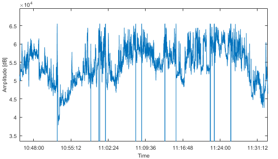
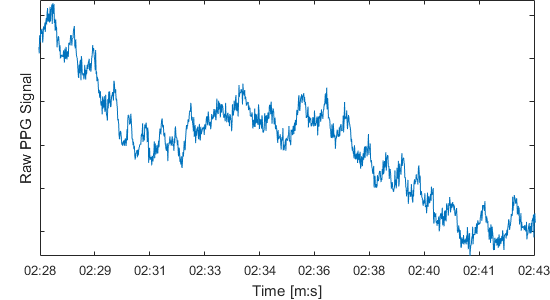

# PPG-heart-rate-classifier
Extract quality heart rate segments from noisy/motion affected raw PPG measurements. Once trained, the model can be integrated into a mobile application to automatically detect heart rate patterns in live PPG stream (e.g. via BLE) and calculate the person's BPM number.

See _thesis_excerpt.pdf_ and _HRClassifier.py_ for details

Go from this:

 Long term PPG measurement

to this:

 Positively classified segment, zoomed in 97.5 beats per minute

